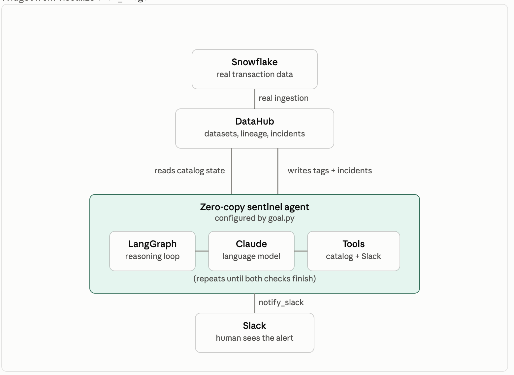

# Zero-Copy Sentinel

A DataHub hackathon submission (track: **"Agents That Do Real Work"**) that catches the
failure mode zero-copy data sharing quietly introduces: when nothing pipelines the data,
nothing fails loudly when it drifts.

> **The pitch:** Zero-copy sharing (Workday Data Connect, Snowflake, Databricks, MotherDuck
> — all shipping this pattern in 2026) eliminates the ETL pipeline data teams used to watch
> for failure. No pipeline means no failure signal — drift goes unnoticed until someone
> builds a decision on bad data. This agent reads DataHub's lineage graph, catches that
> drift, and writes the finding back so the next person or agent inherits it.

Built on **LangGraph + DataHub's Agent Context Kit, powered by Claude**.




## What it catches

**1. Value drift** — a dashboard sits on a materialized copy of a table that also has a
live, zero-copy source of truth. The two disagree. The agent tags the copy
`stale-copy-risk` and writes the exact drift numbers into its description.

**2. Schema drift** — a downstream column's lineage points at an upstream column that no
longer exists (dropped or renamed at the source, silently, because there's no pipeline to
break). The agent raises a `DATA_SCHEMA` Incident on the affected asset.

Both checks post a Slack alert so the finding reaches a human outside DataHub, not just
inside it.

## How it works

- **`agent.py`** — the skeleton: connects to DataHub, loads the Agent Context Kit's tools
  (`build_langchain_tools`) plus this project's custom tools, wires a LangGraph
  `create_react_agent`, and runs the goal — streaming each tool call and result to the
  terminal as it happens, so you watch the agent think instead of waiting for a final report.
- **`goal.py`** — the sentinel's actual instructions: a `SYSTEM_PROMPT` (read before you
  act, be conservative, report explicitly even when nothing's wrong) and a `GOAL` that
  runs both drift checks.
- **`custom_tools.py`** — two tools the Agent Context Kit doesn't ship:
  - `raise_incident` — wraps DataHub's `raiseIncident` GraphQL mutation (confirmed via
    live schema introspection, not assumed from docs).
  - `notify_slack` — posts to an incoming webhook, reading `SLACK_WEBHOOK_URL` from `.env`.
- **`seed_zero_copy_demo.py`** — seeds the demo scenario. Two modes:
  - `--mode seeded` (default) — fabricates both datasets locally, no external dependencies.
  - `--mode snowflake` — enriches a real, already-ingested Snowflake table instead of
    fabricating one.
- **`snowflake/`** — SQL to set up a real Snowflake table (`REVENUE_LIVE_ICEBERG`), add a
  `discount_pct` column, then drop it later to trigger genuine schema drift on a real
  warehouse.
- **`snowflake_ingest.yml`** — DataHub ingestion recipe for pulling that table in.
  Lineage/usage extraction is disabled because it needs `SNOWFLAKE.ACCOUNT_USAGE` access
  the ingest role doesn't have (lineage is set manually via the SDK instead).
- **`ingest.sh`** — wrapper that sources `.env` before running `datahub ingest`. The raw
  command fails with `expandvars.UnboundVariable` in a plain terminal because the recipe's
  `${SNOWFLAKE_*}` placeholders resolve from real environment variables — use this instead.
- **`reset_demo.py`** — resets the demo dataset to its pristine state (removes the
  `stale-copy-risk` tag, restores the description, hard-deletes incidents). Run it between
  demo takes — the agent's write-backs are real, so a dry run dirties the catalog.

**Every write-back in this project has been independently confirmed against DataHub's raw
GraphQL API — not just the agent's own self-report.** That includes catching a real bug
along the way: re-running `datahub ingest` after seeding the zero-copy properties silently
wiped them (DataHub aspects are last-writer-wins, not merged) — caught because the agent
correctly reported a missing property instead of hallucinating a number.

## Requirements

- **Docker Desktop** — to run DataHub locally (8 GB+ RAM recommended)
- **Python 3.11** recommended (works on 3.9+)
- A running **DataHub instance** — [Quickstart](https://docs.datahub.com/docs/quickstart):
  `pip install acryl-datahub` → `datahub docker quickstart`
- A DataHub **personal access token** — UI → Settings → Access Tokens
  ([enable token auth first](https://docs.datahub.com/docs/authentication/personal-access-tokens)
  if the button is greyed out)
- An **Anthropic API key** (or another provider — swappable via `AGENT_MODEL`)
- Optional, for the real-Snowflake path: a Snowflake account and a **Slack incoming
  webhook** URL

## Quickstart

```bash
python -m venv .venv && source .venv/bin/activate
pip install -r requirements.txt

cp .env.example .env      # fill in DATAHUB_GMS_URL, DATAHUB_GMS_TOKEN, ANTHROPIC_API_KEY
                           # optionally: SNOWFLAKE_*, SLACK_WEBHOOK_URL (all documented there)

python seed_zero_copy_demo.py     # seeds the demo scenario (--mode seeded by default)
python agent.py                   # runs the sentinel
python reset_demo.py              # optional: undo the agent's write-backs to re-demo
```

To run against a real Snowflake table instead of the fabricated demo data:

```bash
pip install 'acryl-datahub[snowflake]'
# run snowflake/01_setup.sql and 02_add_discount_column.sql in Snowsight first
./ingest.sh                                      # sources .env, then datahub ingest
python seed_zero_copy_demo.py --mode snowflake   # update LIVE_DATASET_URN to your real URN first
python agent.py
# later, to trigger real schema drift:
#   run snowflake/03_drop_discount_column.sql in Snowsight, then re-run ./ingest.sh
```

> ⚠️ **Notes**
> - This agent has **write access** to your catalog (`include_mutations=True`) — point it
>   at a local/test instance first.
> - DataHub won't apply a **tag that doesn't exist yet** — `seed_zero_copy_demo.py`
>   creates all the tags this project uses, so run it before `agent.py`.
> - `notify_slack` fails loudly (not silently) if `SLACK_WEBHOOK_URL` isn't set.
> - In `--mode snowflake`, the seed script attaches the copy dataset to the real
>   `FINANCE_DB.PUBLIC` schema container via `LIVE_SCHEMA_CONTAINER_URN` (a deterministic
>   hash of platform + database + schema). If that lookup 404s on your instance, copy the
>   container URN from your DataHub UI into `seed_zero_copy_demo.py`.

## Resources

- [DataHub](https://datahub.com) · [Agent Context Kit](https://docs.datahub.com/docs/dev-guides/agent-context/agent-context)
- Forked from DataHub's [Agent Starter](https://github.com/datahub-project/datahub-skills) template.

## License

Apache License 2.0 — see [`LICENSE`](LICENSE).